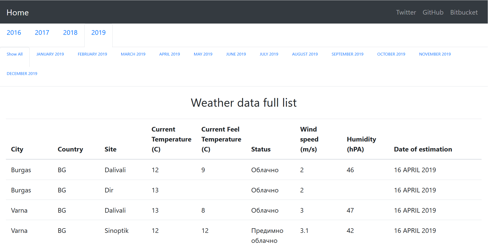

# WeatherSystem
ISoftBG test project as part of an internship program.

A RESTful spring boot app that communicates with a simple React UI for yearly and monthly weather checking and stores the weather data extracted from various website in a PostgreSQL database. It uses [Okta](https://developer.okta.com/blog/2018/07/19/simple-crud-react-and-spring-boot)'s OAuth2 API to authenticate the user.



## Requirements
- Java JDK 1.8 / Java 8 or higher.
- [Node Package Manager](https://www.npmjs.com/).
- Spring boot v2.1.2 or higher.
- PostgreSQL driver v42.2.5 or higher.
- An [Okta](https://www.okta.com/) developer account.
- Maven or an IDE that supports it.

## Execution
You need to configure your application.yml file and your own database url, username and password.

Run the following command in your project path or just run it through your IDE:
```java
mvn spring-boot:run
```
To repackage the app and run it as a .jar file you can run the following:
```java
mvn clean install
java -jar target/WeatherSystem-0.0.1-SNAPSHOT.jar 
```
To start the React UI, navigate to src\main\weather-system and run:
```java
npm start
```
The server will start at https://localhost:8080/ and the UI at https://localhost:3000/.
